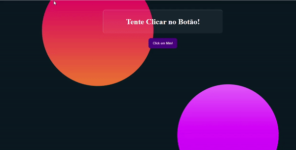

# Desafio-do-Click

Esse projeto tem como objetivo o usuário tentar clicar em um botão.  Foi usado para desenvolvimento conhecimento básico em JS e HTML/CSS. Para o CSS foi usado tendencias de 2021.

 Veja como funciona

